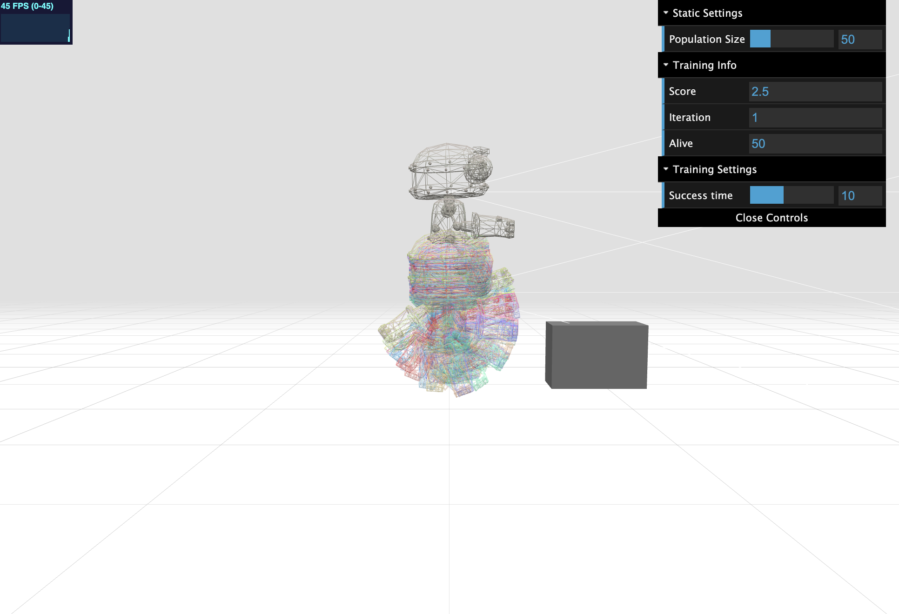

# Genetic AI

> Genetic AI experiment letting agents learn to jump in 3D. Genes control the sensors direction and weights which influence when the agents decide to jump.

<a href="https://maperz.github.io/genetic-ai">Click here to play with it!</a>

  

## Roadmap

- [x]  ~~Implement simulation environment (agents, boxes, hit-testing)~~
- [x]  ~~Control agents based on genes~~
- [x]  ~~Create new generation based on best fitting genes of previous generations~~
- [x]  ~~Showcase the generation performance, emphasis on evolution (graph)~~
- [ ]  Add more gene-based factors (angle of sensors, number of sensors, speed)
- [ ]  Make level generation (boxes) create more difficult scenarios
- [ ]  Make level generation manually possible

## Attribution

- Robot model by Tomás Laulhé, modifications by Don McCurdy CC0.